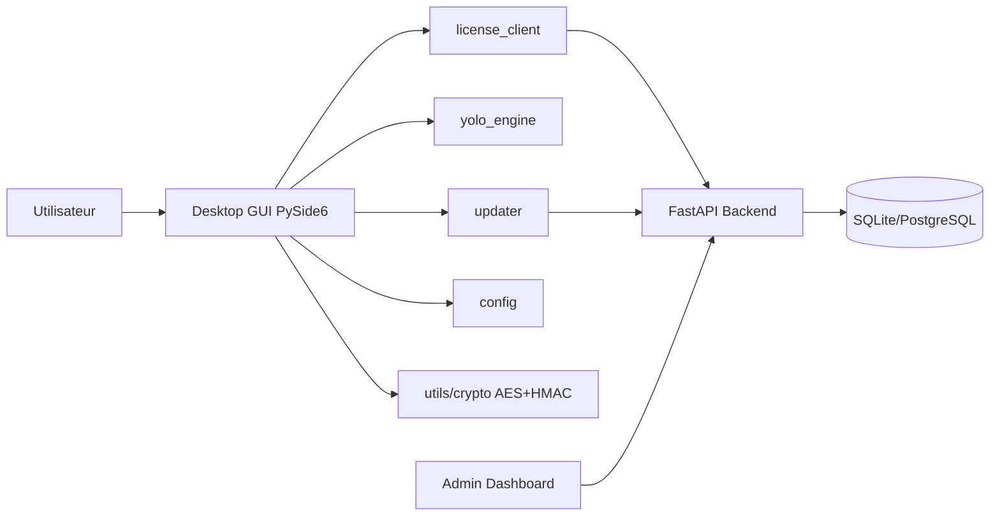
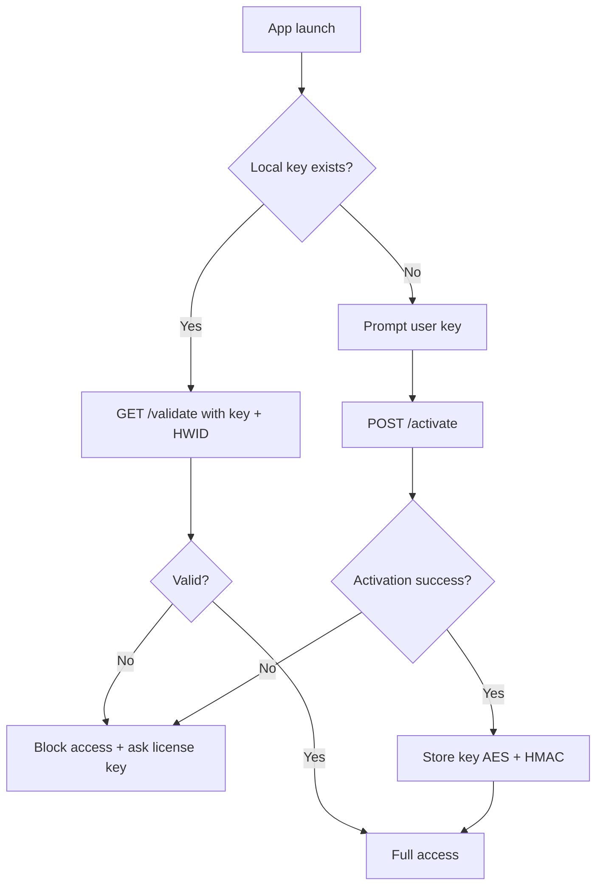

# Architecture Client-Serveur

## Vue d'ensemble



## Architecture backend

```mermaid
flowchart TD
    MAIN[app.main] --> ROUTER1[/generate_key]
    MAIN --> ROUTER2[/activate]
    MAIN --> ROUTER3[/validate]
    MAIN --> ROUTER4[/updates/latest]
    MAIN --> DASH[/admin]
    ROUTER1 --> LS[LicenseService]
    ROUTER2 --> LS
    ROUTER3 --> LS
    ROUTER4 --> US[UpdateService]
    LS --> SEC[Hash key + HWID hash]
    LS --> DB[(license_keys)]
```

## Flowchart Activation Licence


